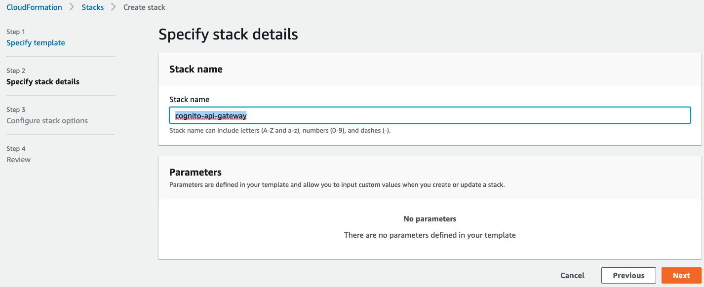
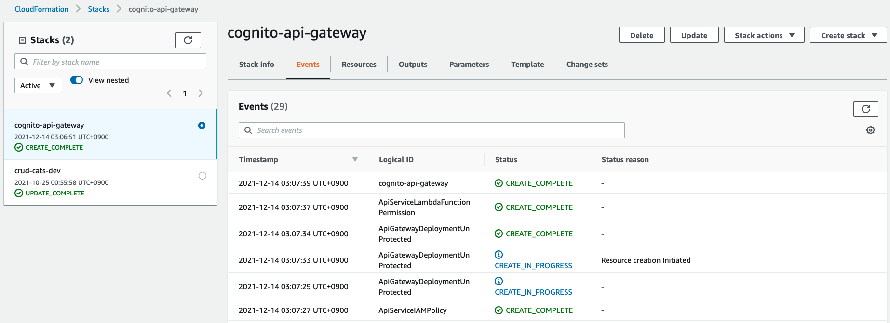
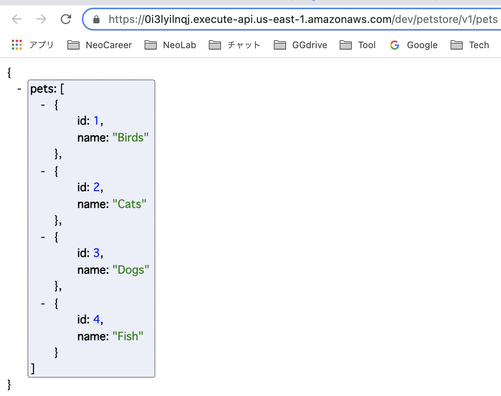

# cformation-cognito-api-gw (without Authorizer cognito) 🐳


[](https://github.com/tquangdo/cformation-cognito-api-gw/issues/new)

## note
+ must name CFormation's stack name = "cognito-api-gateway"


## reference
[vtiblog](https://vtitech.vn/authorization-su-dung-amazon-cognito-api-gateway-va-iam-phan-1/)

## flow
### 1/ Tạo S3 lưu trữ Lambda
```shell
CF_STACK_NAME="cognito-api-gateway"
ACCOUNT_ID=$(aws sts get-caller-identity --query 'Account' --output text)
STACK_REGION=$(aws configure get region)
S3_BUCKET_NAME="${CF_STACK_NAME}-${ACCOUNT_ID}-${STACK_REGION}-lambdas"
=>
aws s3api create-bucket \
      --bucket ${S3_BUCKET_NAME} \
      --region us-east-1
{
    "Location": "/cognito-api-gateway-462123133781-us-east-1-lambdas"
}
```
### 2/ Upload source lên S3
```shell
aws s3 cp ./cf-lambdas/pets-api.zip s3://$S3_BUCKET_NAME
=>
upload: cf-lambdas/pets-api.zip to s3://cognito-api-gateway-462123133781-us-east-1-lambdas/pets-api.zip
```
### 3/ CFormation: create stack
+ create stack > new resources (standard) > import "api-resource.yaml" > create

### 4/ Tạo Service sử dụng Cloudformation
```shell
aws cloudformation deploy --template-file ./infrastructure/api-resource.yaml \
     --stack-name $CF_STACK_NAME \
     --s3-bucket $S3_BUCKET_NAME \
     --s3-prefix cfn \
     --capabilities CAPABILITY_NAMED_IAM
=>
Uploading to cfn/b6ba0579a3a635f89be8ffad052a9b70.template  5032 / 5032.0  (100.00%)
Waiting for changeset to be created..
No changes to deploy. Stack cognito-api-gateway is up to date
```
### 5/ Tiến hành test API đã được tạo ra
```shell
API_URL=$(aws cloudformation describe-stacks \
    --stack-name ${CF_STACK_NAME} \
    --query 'Stacks[0].Outputs[0].OutputValue' --output text)
echo "${API_URL}"
=>
https://0i3lyilnqj.execute-api.us-east-1.amazonaws.com/dev/petstore/v1/pets
```
```shell
API_URL=$(aws cloudformation describe-stacks \
    --stack-name ${CF_STACK_NAME} \
    --query 'Stacks[0].Outputs[1].OutputValue' --output text)

echo "${API_URL}"
=>
https://0i3lyilnqj.execute-api.us-east-1.amazonaws.com/dev/petstore/v2/pets
```
### 6/ run API
＋ result get from `Lambda/pets-api/lambda.py`
```py
pets = [
    {
        "id": 1,
        "name": "Birds"
    },
    {
        "id": 2,
        "name": "Cats"
    },
    {
        "id": 3,
        "name": "Dogs"
    },
    {
        "id": 4,
        "name": "Fish"
    }
]
```

