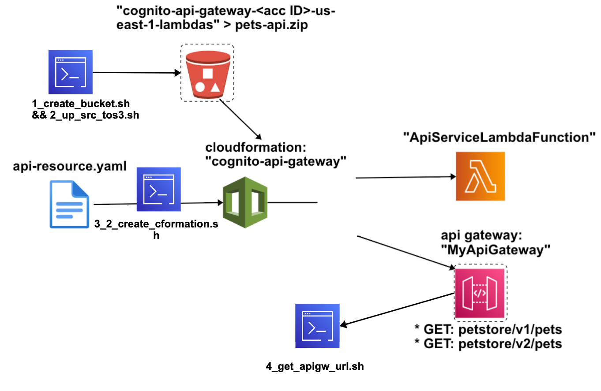

# aws-cformation-nocognito-api-gw (without Authorizer cognito) 🐳


[](https://github.com/tquangdo/aws-cformation-nocognito-api-gw/issues/new)



## reference
[vtiblog](https://vtitech.vn/authorization-su-dung-amazon-cognito-api-gateway-va-iam-phan-1/)

## !! ⚠️⚠️WARNING⚠️⚠️ !!
+ must name CFormation's stack name = "cognito-api-gateway" due to `*.sh`


## flow
### 1/ Tạo S3 lưu trữ Lambda
```shell
cd shell
chmod +x *.sh
./1_create_bucket.sh
=>
{
    "Location": "/cognito-api-gateway-<acc ID>-us-east-1-lambdas"
}
```
### 2/ Upload source lên S3
```shell
shell$ ./2_up_src_tos3.sh
=>
upload: cf-lambdas/pets-api.zip to s3://cognito-api-gateway-<acc ID>-us-east-1-lambdas/pets-api.zip
```
### 3/ CFormation: create stack
#### 3-1) manual
+ create stack > new resources (standard) > import "api-resource.yaml" > create

### 3-2) AWS CLI
```shell
shell$ ./3_2_create_cformation.sh
=>
Uploading to cfn/b6ba0579a3a635f89be8ffad052a9b70.template  5032 / 5032.0  (100.00%)
Waiting for changeset to be created..
No changes to deploy. Stack cognito-api-gateway is up to date
```
### 4/ Tiến hành test API đã được tạo ra
```shell
shell$ ./4_get_apigw_url.sh
=>
https://0i3lyilnqj.execute-api.us-east-1.amazonaws.com/dev/petstore/v1/pets
https://0i3lyilnqj.execute-api.us-east-1.amazonaws.com/dev/petstore/v2/pets
```
### 5/ run API
+ result get from `Lambda/pets-api/lambda.py`
```py
pets = [
    {
        "id": 1,
        "name": "Birds"
    },
    {
        "id": 2,
        "name": "Cats"
    },
    {
        "id": 3,
        "name": "Dogs"
    },
    {
        "id": 4,
        "name": "Fish"
    }
]
```

